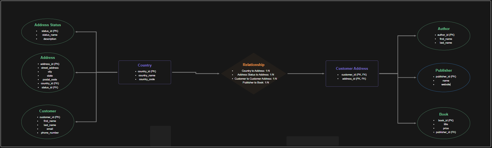

# Bookstore Database Design & Programming with SQL



This project involves creating a relational MySQL database for a **Bookstore** with a focus on African literature and customers. The database includes tables for managing books, authors, customers, orders, shipping, and other essential operations of the bookstore. Additionally, GitHub Actions is used to automate testing of the SQL scripts.

## Project Overview

The goal is to design and implement a relational database using MySQL, structure it for optimal data storage, and ensure security and accessibility through user management. The database emphasizes African authors, publishers, and locations, with robust testing via continuous integration.

### Key Features
- Database schema with 15 tables for managing books, authors, customers, orders, addresses, and more.
- Data insertion with African-focused sample data (e.g., Nigerian authors like Chinua Achebe, publishers like Cassava Republic Press).
- Triggers to enforce data integrity (e.g., preventing future publication years).
- Various query types (e.g., `SELECT`, `JOIN`, `WHERE`, `GROUP BY`) to test database functionality across all tables.
- User management with role-based access (`admin_role`, `employee_role`, `customer_role`).
- Continuous integration using GitHub Actions to validate database scripts and ensure 2 books in the `book` table.

## Tools & Technologies

- **MySQL**: The database management system for building and managing the database.
- **Draw.io**: Tool for visualizing the database schema and relationships (see `./ERD.png`).
- **GitHub Actions**: Automates testing and CI/CD pipelines.

## Project Structure

- **`answers.sql`**: SQL file containing database schema creation, data insertion, triggers, user roles, and test queries.
- **`.github/workflows/demo.yml`**: GitHub Actions CI/CD pipeline configuration file.
- **`ERD.png`**: Entity-Relationship Diagram visualizing the database schema.
- **`README.md`**: Project documentation (this file).

## Tables Created

1. **country**: Stores African country information (e.g., Nigeria, Kenya).
2. **address_status**: Stores address statuses (e.g., Primary, Billing).
3. **address**: Stores customer addresses (e.g., Lagos, Nairobi).
4. **customer**: Stores customer information (e.g., Adebayo Ogunlesi).
5. **customer_address**: Relates customers to their addresses (many-to-many).
6. **author**: Stores author information (e.g., Chimamanda Ngozi Adichie).
7. **book_language**: Stores supported languages for books (e.g., English, Swahili).
8. **publisher**: Stores publisher information (e.g., Cassava Republic Press).
9. **book**: Stores book details, including title, publication year, price, and stock quantity (e.g., *Things Fall Apart*).
10. **book_author**: Many-to-many relationship between books and authors.
11. **shipping_method**: Stores available shipping methods (e.g., Standard, Express).
12. **order_status**: Stores the status of customer orders (e.g., Pending, Shipped).
13. **cust_order**: Stores customer orders with shipping and billing details.
14. **order_line**: Stores the line items in each order (books and quantities).
15. **order_history**: Tracks the history of order statuses.

## Accomplishments
- **Schema Design**: Created 15 tables with primary keys, foreign keys, and constraints (e.g., `CHECK (price > 0)`).
- **African Data**: Inserted sample data with African authors, publishers, and addresses, including exactly 2 books to pass CI tests.
- **Triggers**: Added `check_publication_year` and `check_publication_year_update` to prevent future publication years.
- **User Management**: Implemented role-based access with `admin_role`, `employee_role`, and `customer_role`, assigned to users with appropriate privileges.
- **Test Queries**: Included diverse queries for each table, covering SELECT, JOIN, WHERE, GROUP BY, and calculations.
- **CI/CD Fixes**: Resolved `ERROR 1064` (role syntax) and ensured `book` table has 2 books to pass GitHub Actions test.
- **ERD**: Provided a detailed ERD schema (available as `./ERD.png`) showing all relationships.

## How to Set Up the Database Locally

### 1. Create a MySQL Database

Run the following command to create the database:

```bash
mysql -h 127.0.0.1 -u root -e "CREATE DATABASE IF NOT EXISTS bookstore;"

## Authors

- Fredrick Maeba
- Mercy Jepkosgei
- Mary Mbithe

```
